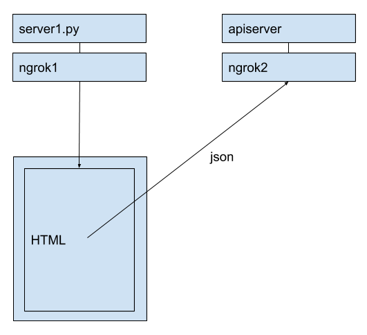

# Overview
I'm having trouble with CORB on Android WebView with Chrome 75.

I believe I set CORS related header correctly, because CORB happens randomly, not always.
The code also worked well with Chrome 74 or earlier or 76.
When CORB happens once, it happens forever until app data is reset.
I saw this happens to a few of my customers' devices including my colleague's Galaxy S10e (Android 9.0).
All were from Chrome 75.

To reproduce this issue, I made an example.
It consists of ~~2 Rails servers~~ 2 python servers and 1 Android app.
For HTTPS, I used [ngrok](https://ngrok.com/). I guess you can use ngrok freely.

## HTML server
It provides simple HTML. See https://github.com/keewon/corb_chrome75_test/blob/master/python_servers/server1.py
Inside the HTML, it calls `fetch()` to fetch response from the JSON API server.

 - Python3 is required

## JSON API server
It provides 5K bytes of JSON response.
It puts CORS related headers to the response header. See https://github.com/keewon/corb_chrome75_test/blob/master/python_servers/apiserver.py

 - Python3 is required
 
## Android app
Built with Android SDK 27.
It has a WebView and it loads data with `WebView.loadDataWithBaseURL`.
https://github.com/keewon/corb_chrome75_test/blob/master/android_app/app/src/main/java/com/acidblob/corbtest/MainActivity.java#L73
I guess this is the main difference between this example and browser.

Please put the first part of ngrok1 host name into the TextField. (Usually 8 characters of hex string)
When button is clicked, it loads HTML first from the HTML server.
HTML will fetch data from the JSON API server.

## My Android device setting
 - Essential phone (PH-1)
 - Android 9
 - Installed Chrome(75.0.3770.89), Chrome Beta(76.0.3809.21) and Chrome Dev (77.0.3828.0)
 - I Chose Chrome 75 as a WebView implementation in Developer Option.
 - I failed to reproduce this on the emulator.

# How to reproduce CORB error
 A. Run following commands on separated terminal
   - `make ngrok1` (for HTML server)
   - `make ngrok2` (for JSON API server)
   - `make run1` (HTML server)
   - `make run2` (JSON API server)

 B. When the android app is launched, set ngrok1 host, and click the button 1~2 times.
    You will see 'Waiting for apiserver'. Then it will be changed to the JSON data.
    

 C. When B is successful, kill the app. Relaunch the app. Click the button 2~3 times again.

 D. When 'Waiting for apiserver' is changed to `warning: response is zero length`, it means CORB happened.
    You may connect desktop chrome inspector (chrome://inspect#devices) and reclick the button.
    Once CORB happened, it happens until you clear app data even you relaunch the app.

 E. Even though you tried B and C several times, it may not be reproduced.
    In that case,
      - kill the app
      - clear app data
      - relaunch app

 F. 10 ~ 50 iterations may reproduce this.

Thanks for reading this README.
